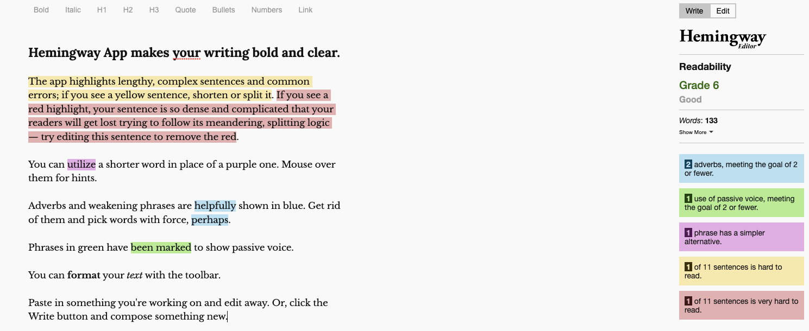

Writing is a lot of fun and a great way to express yourself, share knowledge,
and turn into a better teacher. It's not easy, and takes a huge investment
and dedication to put written content together at high quality but if you're
reading this, you're probably enjoying it.

So, how do we make it easier to write and publish content?

In this article I am curating a list of resources, tools, and services that
make it easier to write and publish content. I am not affiliated with any of
these myself unless I've strictly written so, and I am not getting paid to
promote them.

## Assisted writing

English is not my first language, and I am not a native speaker. If you're
in the same boat then you can easily relate to the difficulty in putting
sentences together.

The following is a list of tools that can help you with writing, 
phrasing and grammar review and suggestions.

* [Grammarly](https://www.grammarly.com/) probably needs no introduction. It's a pretty popular tool that
helps with anything from writing emails to blog posts. It's also a great
tool for improving your writing and making it easier to read, especially
if you're not a native speaker.
* [Hemingway](https://hemingwayapp.com/) is a tool that helps you write better by highlighting
difficult-to-read sentences and common errors. It's a great tool for
improving your writing and making it easier to read.

## Colors and Branding

If you want to apply specific branding colors to your content, it's a good
idea to use a tool that can help you with figuring out a color palette that
works well together.

Here are those that I found very useful and am using myself for my own
books:
* [Color Thief](https://lokeshdhakar.com/projects/color-thief/)
* [Coolors](https://coolors.co/)

## Publishing content

Once you've got your content written, you need to publish it. Publishing
content means essentially that you need to convert raw text content into
a published format. This can be an online HTML version of a book, or a
digital book such as a PDF or ePub.

The following are tools that can help you with creating a published
format of your raw content into a distributed format, such as a PDF or
ePub.

* [Magic author](https://magicauthor.com/)

## Courses creation and hosting

* [Mirio](https://mirio.org/)
* [scrimba](https://scrimba.com/)
* [Lighthall](https://www.lighthall.co) - Fun, live interactive classes with teachers.